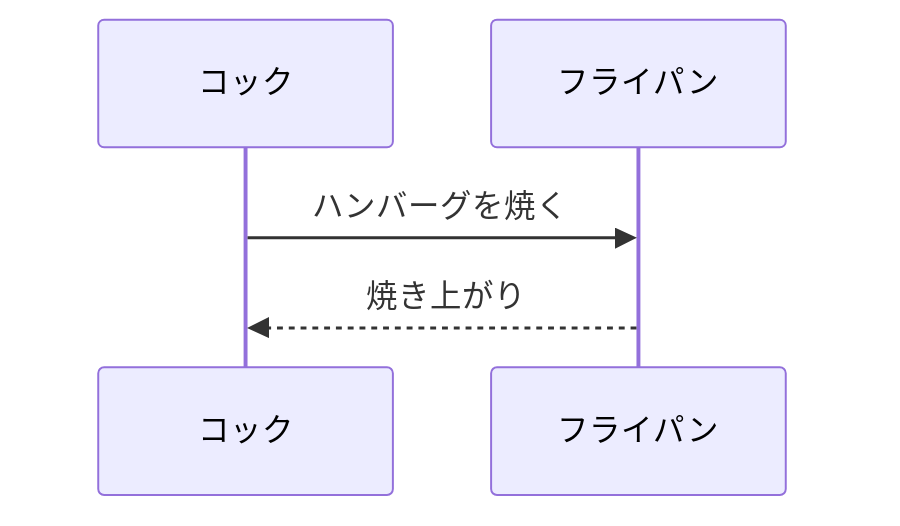

# sbwap
SpringBoot Web Application

---
# 子プロジェクトの配置方法

```
[settings.gradle]

include('sblib')

rootProject.name = 'sbwap'
rootProject.children.each { it.name = rootProject.name + '_' + it.name }
```

- 「settings.gradle」に、記述を追加する。

  - 「include('[取り込む子プロジェクトのフォルダ]')」を記述する。
  - 「rootProject～」により、取り込む子プロジェクトに親プロジェクト名を付与。  
    これにより、複数の親プロジェクトで同じ子プロジェクトを取り込んでも、  
    バッティングしないプロジェクト名とできる。(eclipseなどでも取り込める  
    ようにするために必要な設定)
  
```
[build.gradle]

// ライブラリプロジェクトを使用するための設定
implementation project(':sbwap_sblib')
```

- 「build.gradle」に、記述を追加する。

  - このとき記述するのは「settings.gradle」で設定した親プロジェクト名を  
    プレフィックスとする、バッティングしないプロジェクト名とすること。

---
# 資材配置について

- 子プロジェクトに集めて共通化したい資材は、子プロジェクト側に配置する。  
  ＜例＞共通メッセージプロパティ、共通クラス群(サービス層以下全部)  
- 親プロジェクト側にはプロジェクト固有の資材のみを配置する。  
  ＜例＞コントローラ、親クラスの画面資材

---
# Gitサブモジュール構成の構築

- 任意のディレクトリを新しく作成し、移動する。(コマンドプロンプト)
```
	＜例＞
	mkdir C:\10_local\project\submodule
```

- 最初に親となる「sbwap」をクローンする。(コマンドはGitBashにて実行する)
```
	git clone [Gitリポジトリ]
	＜例＞
	git clone https://github.com/suteado90573/sbwap
```

- 親の「sbwap」ディレクトリにてGitBash上から、次のコマンドを実行する。
```
	cd sbwap/
	git submodule add https://github.com/suteado90573/sblib sblib
	※　子である「sblib」のリポジトリを「sblib」というエイリアス名で、
		サブモジュールとするコマンドを実行。
		git submodule add [リポジトリ] [エイリアス]
```

- 「sbwap」ディレクトリ直下に「sblib」ディレクトリと「.gitmodules」が生成されたことを確認。  
「sblib」ディレクトリはリポジトリ資材、「.gitmodules」はサブモジュールコマンドの内容が書かれている。

- 続けてGitBash上から、次のコマンドを実行する。
```
	git submodule init
	git submodule update
```

- GitBash上から、次のコマンドを実行。
```
	git status
```

- commit&pushを実行する。
```
	git add .
	git commit -m "sblibをsbwapのサブモジュールとして設定。"
	git push origin main
```

---
# Gitサブモジュール構成の取得

- 任意のディレクトリを新しく作成し、移動する。(コマンドプロンプト)
```
	＜例＞
	mkdir C:\10_local\project\dev
```

- 最初に親となる「sbwap」をクローンする。(コマンドはGitBashにて実行する)
```
	git clone [Gitリポジトリ]
	＜例＞
	git clone https://github.com/suteado90573/sbwap
```

- 「sbwap」ディレクトリ直下に「sblib」ディレクトリと「.gitmodules」が生成されたことを確認。  
「sblib」ディレクトリはリポジトリ資材、「.gitmodules」はサブモジュールコマンドの内容が書かれている。

- 続けてGitBash上から、次のコマンドを実行する。
```
	cd sbwap
	git submodule init
	git submodule update
```

---
# プロパティファイルの記述内容について

- 「application.properties」にはSpringBootの起動時に読み込む設定を記述する。  
  (デフォルトの挙動を変えたいときに、SpringBootが持っているプロパティの設定を  
  個別に指定するための設定ファイル)
- ユーザが独自に定義したプロパティを認識させたい場合は「custom.properties」  
  のような別のプロパティファイルとすること。
- ユーザ定義プロパティファイル(ここでは例示として「custom.properties」という  
  ファイル名とする)を取り込むためには、「application.properties」に次のような  
  設定を追加する。

```
[application.properties]

## Custom property settings
spring.config.import=custom.properties
```

---
# プロパティファイルの配置について

- 「application.properties」は、親となるWebアプリ側にのみ配置する。  
  (　「custom.properties」のような、従属するプロパティファイルも同様)
- ただし従属するプロジェクト側を単独のGradleプロジェクトとし、ビルドに  
  よって全テストを行う場合、「application.properties」及び従属する  
  「custom.properties」などのプロパティファイルは、test/resources配下  
  に配置する。(こうすると、JUnit全テスト時にはtest/resources配下に配置  
  したプロパティファイルに基づいて動作させることができる)

---
# 【ToDo】環境ごとのプロパティファイルについて

- 【ToDo】サンプル及び記載を追加する。

---
# Gradleビルドが出る場合の対応について
Gradleビルド時にテストエラーとなってしまう場合の対応は、次の通り。
- テストエラーを確認する。
- インジェクションするクラスが存在しないというエラーの場合、  
  使っているSpringBootの機能に必要な設定が「application.properties」  
  に記載されているか確認する。  
  ＜例＞  
  - データベースアクセスがある場合、「application.properties」に  
    「spring.datasource～」で始まる諸設定がないと動かない。
  - JavaMailSenderを使う場合、「spring.mail.host」と「spring.mail.port」  
    の設定がないと動かない。

---
# h2データベースを使用するための設定について
「build.gradle」にh2を使用するための設定記述が必要。
```
[build.gradle]

	// h2DBを使用するための設定
	runtimeOnly 'com.h2database:h2'
```

「application.properties」に、データソースの設定が必要。

```
[application.properties]

## datasource settings
spring.datasource.url=jdbc:h2:~/test
spring.datasource.driver-class-name=org.h2.Driver
spring.datasource.username=sa
spring.datasource.password=
spring.sql.init.mode=always
spring.sql.init.schema-locations=classpath:dbinit/schema.sql 
spring.sql.init.data-locations=classpath:dbinit/data.sql 
```
- 「spring.sql.init.mode=always」を指定すると、SpringBoot起動時に  
  必ず毎回初期化SQLを実行してオンメモリのDBスキーマを作成する。  
  (簡易動作確認に便利なやり方)
- 「spring.sql.init.schema-locations」でDB構築SQL、  
  「spring.sql.init.data-locations」でDB初期化SQLを指定できる。  
  前者はDROP-CREATEのSQLを記述する。(SpringBoot起動時、毎回DB初期化する)  
  後者は初期データ投入のSQLを記述する。

また「application.properties」に次の設定を追加することで、  
ブラウザからh2のコンソールにアクセスできるようになる。

```
[application.properties]

## h2 settings
spring.h2.console.enabled=true
```
SpringBootを起動すると、コンソールに次のような表示が出る。
```
[SpringBoot起動時のコンソール表示]

[ログ時刻やクラス名] H2 console available at '/h2-console'. Database available at 'jdbc:h2:~/test'
```
- ブラウザを開き、次のURLにアクセスする。  
  http://localhost:8080/h2-console
- 「JDBC URL」の項に上記コンソールに表示されている「jdbc:h2:~/test」の部分を入力する。
- 「Connect」(日本語表示なら「接続」　)をクリックし、ログインできればアクセスに成功している。  
  SELECTを実行すると、投入されている初期データを確認できる。

---
# SpringDocの使用方法
「build.gradle」にSpringDocを使用するための設定記述が必要。
```
[build.gradle]

	// SpringDocを使用するための設定
	implementation 'org.springdoc:springdoc-openapi-starter-webmvc-ui:2.7.0'
```

「application.properties」に、データソースの設定が必要。

```
[application.properties]

## SpringDoc
springdoc.api-docs.path=/api-docs
springdoc.swagger-ui.path=/swagger-ui.html
```
- ブラウザを開き、次のURLにアクセスすると、自動生成されたAPI仕様書が確認できる。  
http://localhost:8080/swagger-ui.html
- 次のURLにアクセスすると、swaggerのyamlをダウンロードできる。  
http://localhost:8080/api-docs.yaml

---
# マークダウンでシーケンス図を記述する方法
- VSCodeの場合は「Markdown Preview Enhanced」という拡張機能をインストールする。
- バッククオート3文字に続けて「mermaid」と記述すると、シーケンス図を記述できる。  
サンプル記述は、次のシーケンス図を参照のこと。

- mermaidの記法についてはネット調査のこと。
- 「Markdown Preview Enhanced」は右クリックでHTMLやPDFへの出力も可能。

---
# 【ToDo】MyBatisでスネーク記法のDBカラム名をキャメル記法のエンティティに対応させる方法

- 【ToDo】サンプルはあるので、必要な設定を記述。

---
# 【ToDo】MyBatisでSQLのログを表示する方法

- 【ToDo】サンプルはあるので、必要な設定を記述。

---
# 【ToDo】メッセージプロパティの設定方法

- 【ToDo】サンプルはあるので、必要な設定を記述。

---
# 【ToDo】メール送信方法

- 【ToDo】サンプルはあるので、必要な設定を記述。

---
# redisによるセッション情報の共有
- 「build.gradle」に次の設定を追加する。(SpringSecurityはコンフィグクラスの実装で使う)
```
[build.gradle]

	// SpringSessionを使用するための設定
	implementation 'org.springframework.session:spring-session-core'

	// SpringSecurityを使用するための設定
	implementation 'org.springframework.boot:spring-boot-starter-security'
	implementation 'org.thymeleaf.extras:thymeleaf-extras-springsecurity6'
	testImplementation 'org.springframework.security:spring-security-test'

	// redisを使用するための設定
	implementation 'org.springframework.boot:spring-boot-starter-data-redis'
	implementation 'org.springframework.session:spring-session-data-redis'
```
- SpringSessionのコンフィグクラスを追加する。
```java
package com.sb.sblib.config;

import org.springframework.beans.factory.BeanClassLoaderAware;
import org.springframework.context.annotation.Bean;
import org.springframework.context.annotation.Configuration;
import org.springframework.data.redis.serializer.GenericJackson2JsonRedisSerializer;
import org.springframework.data.redis.serializer.RedisSerializer;
import org.springframework.security.jackson2.SecurityJackson2Modules;

import com.fasterxml.jackson.databind.ObjectMapper;

@Configuration
public class SessionConfig implements BeanClassLoaderAware {

	private ClassLoader loader;

	@Bean
	RedisSerializer<Object> springSessionDefaultRedisSerializer() {
		return new GenericJackson2JsonRedisSerializer(objectMapper());
	}

	private ObjectMapper objectMapper() {
		ObjectMapper mapper = new ObjectMapper();
		mapper.registerModules(SecurityJackson2Modules.getModules(this.loader));
		return mapper;
	}

	@Override
	public void setBeanClassLoader(ClassLoader classLoader) {
		this.loader = classLoader;
	}
}
```
- 動作確認のためにはredisの起動が必要。  
環境としてはdockerを推奨。「docker-compose.yml」を次の通り記述する。
```docker
[docker-compose.yml]

# サービスを定義する
services:

  # redisの設定
  redis:

    # イメージの指定
    image: redis:latest

    # ポートの設定
    ports:

      # ホスト側の 6379 ポートを、コンテナ側の 6379 ポートにマッピングする
      - "6379:6379"
```
- 「application.properties」に、次の設定を追加する。
```
[application.properties]

## Redis session settings
spring.session.redis.repository-type=indexed
spring.data.redis.host=localhost
spring.data.redis.port=6379
spring.data.redis.password=
```
- 普通のHttpSessionのget/setでredis経由の共有となる。  
複数のWebアプリを起動して、認証情報をセッション情報で共有する場合などに使用できる。  
本来セッション情報は単独のWebアプリ上にあるオンメモリのデータであり、他のWebアプリからは参照できないが、  
この方法でredis経由によるセッション情報の共有が可能となる。
```java
	@GetMapping("/top")
	public String getTop(HttpSession session) {

		// redisセッションに情報を書き込む
		session.setAttribute("redisSessionKey", "This is redis session test.");

		return "top";
	}
```
- redisに入っている値は、docker上のredisサーバにログインして確認できる。  
アプリ側での動作確認が望ましいが、動作が怪しいときはこの方法でも確認した方が確実。
```
[docker composeを起動したプロンプトで、次の順にコマンドを実行]

docker compose exec redis bash
redis-cli
keys *
hgetall [直前の keys * で取得したキー]
＜例＞
hgetall "spring:session:sessions:01cd632c-9a75-4b1d-860f-7b8960cf45f5"
```
- 上記でhgetallに成功すると、次のような画面表示を確認できる。  
(上記コードのsetAttributeで設定した内容がredis上にあることが確認できる)
```
(中略)
 3) "sessionAttr:redisSessionKey"
 4) "\"This is redis session test.\""
 (以下、略)
```

---
# WSL環境の構築
- WindowsPowerShellにて、次のコマンドを実行する。
```
wsl --install
```
- インストールできない場合は、chatGPTやGitHub copilotといったAIに聞く。  
「WSL インストール」などで地道にGoogle検索しても出てくる。  
たいていはコントロールパネルで「Windowsの機能の有効化または無効化」でWSLを有効にすれば解決できる。  
まれにPC起動時のBIOS設定変更が必要なことがあるが、2025年1月時点での一般的なPCではまずその問題は起きない。
- 次のコマンドを実行し、WSLのバージョンが2系(もしくはそれ以上)であることを確認する。
```
wsl -l -v
```
- WSLが2系でない場合は、次のコマンドを実行する。  
時代が進めば「2」のところは「3」とか「4」になるかも知れない。  
AIに聞くかGoogle検索で最新情報を確認し、適宜コマンドは見直す。
```
wsl --set-default-version 2
```
- 次のコマンドでWSLを最新化する。
```
wsl --update
```
- 次のコマンドでWSL環境にUbuntuをインストールする。  
インストール時にはユーザ名とパスワードを聞かれるので準備しておくこと。  
パスワードはポリシーの制約があるので、あまり単純なものはダメ。
```
wsl --install Ubuntu
```
- 別のWindowsPowerShellを起動して次のコマンドを実行し、シャットダウンと起動ができることを確認する。
```
wsl --shutdown
wsl -d Ubuntu
```
- Ubuntu環境にdocker及びdocker composeをインストールする。  
このコマンドはdockerの本家サイトに掲載されており、AIなどに聞いても分かる。  
情報は常に陳腐化する可能性があるので、うまくいかないときは最新のコマンドを調べること。
```
sudo apt update
sudo apt upgrade -y
sudo apt install curl -y
sudo apt install apt-transport-https -y
curl -fsSL https://download.docker.com/linux/ubuntu/gpg | sudo gpg --dearmor -o /usr/share/keyrings/docker-archive-keyring.gpg
echo \
  "deb [arch=$(dpkg --print-architecture) signed-by=/usr/share/keyrings/docker-archive-keyring.gpg] https://download.docker.com/linux/ubuntu \
  $(lsb_release -cs) stable" | sudo tee /etc/apt/sources.list.d/docker.list > /dev/null
sudo apt update
sudo apt install docker-ce docker-ce-cli containerd.io -y
sudo apt install docker-compose -y
sudo service docker start
sudo usermod -aG docker $USER
sudo systemctl enable docker
sudo systemctl status docker
```
- 次のコマンドを実行し、docker及びdocker composeがインストールできているか確認する。
```
docker --version
docker compose version
```
- WSL上にUbuntuを作成すると、エクスプローラでルート以下のディレクトリ構成にアクセスできる。  
/home配下など、適切な場所にdocker-compose.ymlを配置する。
- 次のようなコマンドでdocker composeを起動する。
```
cd [docker-compose.ymlの配置先ディレクトリ]
docker compose up -d
＜例＞
cd /home/develop/tool/docker
docker compose up -d
```

---
# 【ToDo】パッケージ構成について

- 【ToDo】まとまりとして別で記述したい。  
  上記のうち細かいノウハウは、カテゴリごとにナレッジとして整理する。
  パッケージ構成やプロパティなどについては、ナレッジではなく基本事項として
  フォルダ分けして整理したい。

---
# 【ToDo】コントローラ、サービス、ユーティリティ、エンティティ、マッパーなど

- 【ToDo】まとまりとして別で記述したい。  

---
# 【ToDo】ビルド手順

- 【ToDo】まとまりとして別で記述したい。  

---
# 【ToDo】JUnit

- 【ToDo】まとまりとして別で記述したい。  
  モックについて記述。
