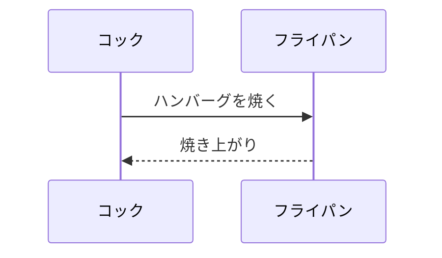

---
# マークダウンでシーケンス図を記述する方法
- VSCodeの場合は「Markdown Preview Enhanced」という拡張機能をインストールする。
- バッククオート3文字に続けて「mermaid」と記述すると、シーケンス図を記述できる。  
サンプル記述は、次のシーケンス図を参照のこと。

- mermaidの記法についてはネット調査のこと。
- 「Markdown Preview Enhanced」は右クリックでHTMLやPDFへの出力も可能。
